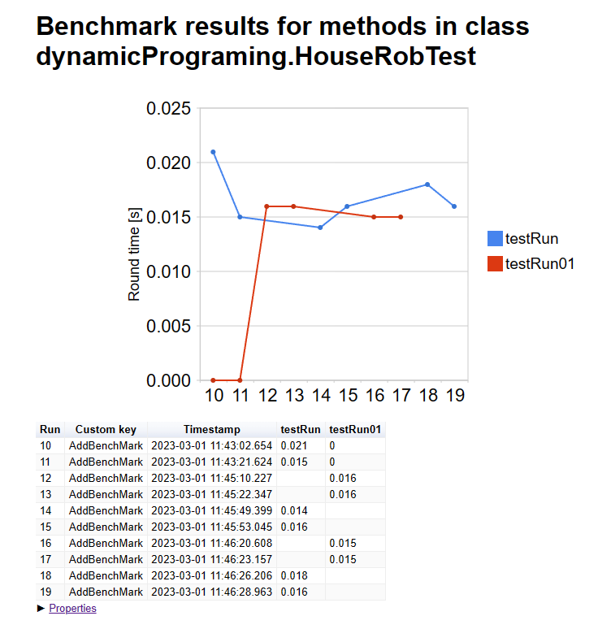

## 在 IDEA 跑测试

分两步，分别是 junit.jar 包下载和导入到 IDEA，及 Junit Generator 插件的使用。

[Download JAR files with all dependencies](https://jar-download.com/)

从上述地址下载 junit-4.1.2。将其解压到 .m2/<自定义文件夹名称>。不建议 repository。

在 IDEA Settings/Project Settings/Modules/Dependencies 导入它。

安装 Junit Generator 插件，并修改 output path（让 test 和 src 同级）。

回到 src 某路径，使用快捷键 Alt + Insert 选中 Junit4 在 Test 文件路径下生成对应的 Test Class。

记得导入 junit-benchmark 和 h2。

### 使用的 jar 包

| Title | Version | Desc |
| --- | --- | -- |
| junit-benchmark | 0.7.2 | 跑分 |
| h2 | 1.4.200 | 内存数据库 |
| junit | 4.12 | 测试工具 |

### 参考

[Junit 基准测试](https://sarkershantonu.github.io/2017/01/08/junit-benchmark/#:~:text=Junit%20Benchmark%20is%20a%20library%20for%20running%20your,usages%20Junit%20Rule%20to%20drive%20multi%20threaded%20execution.)